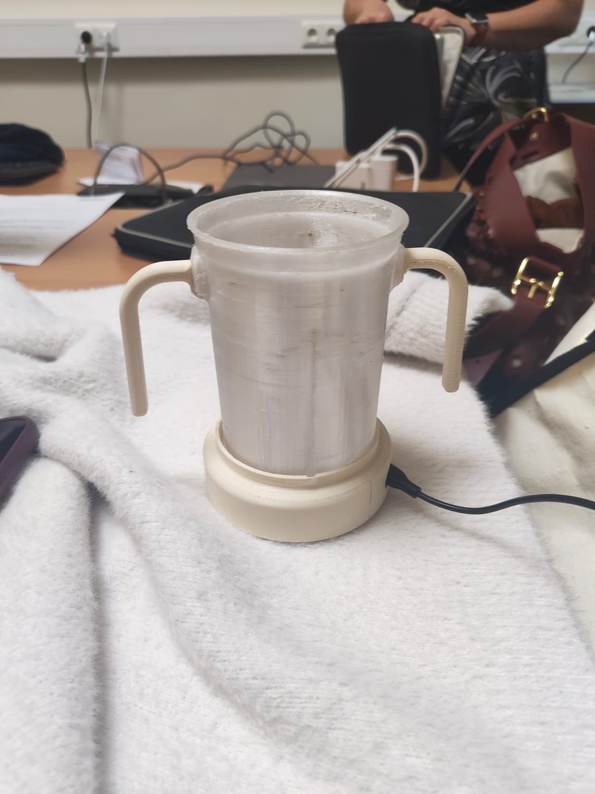
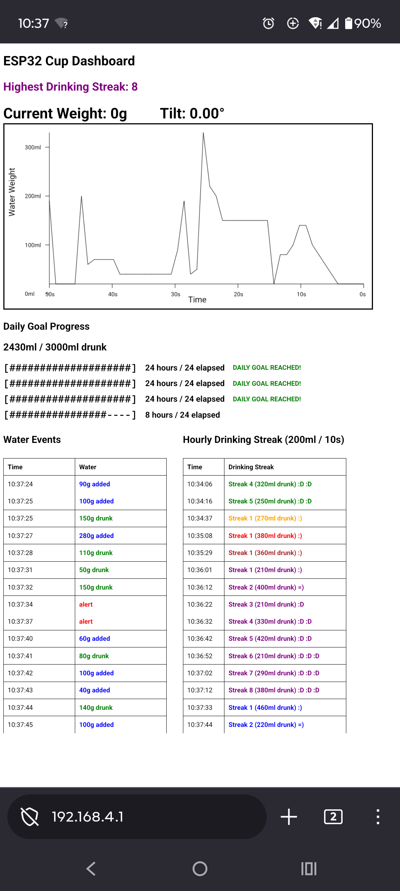
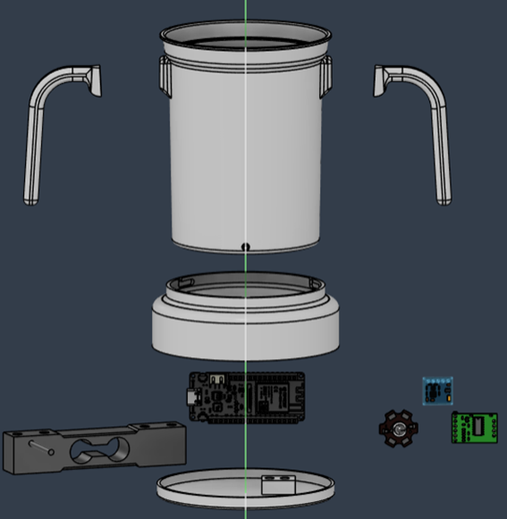
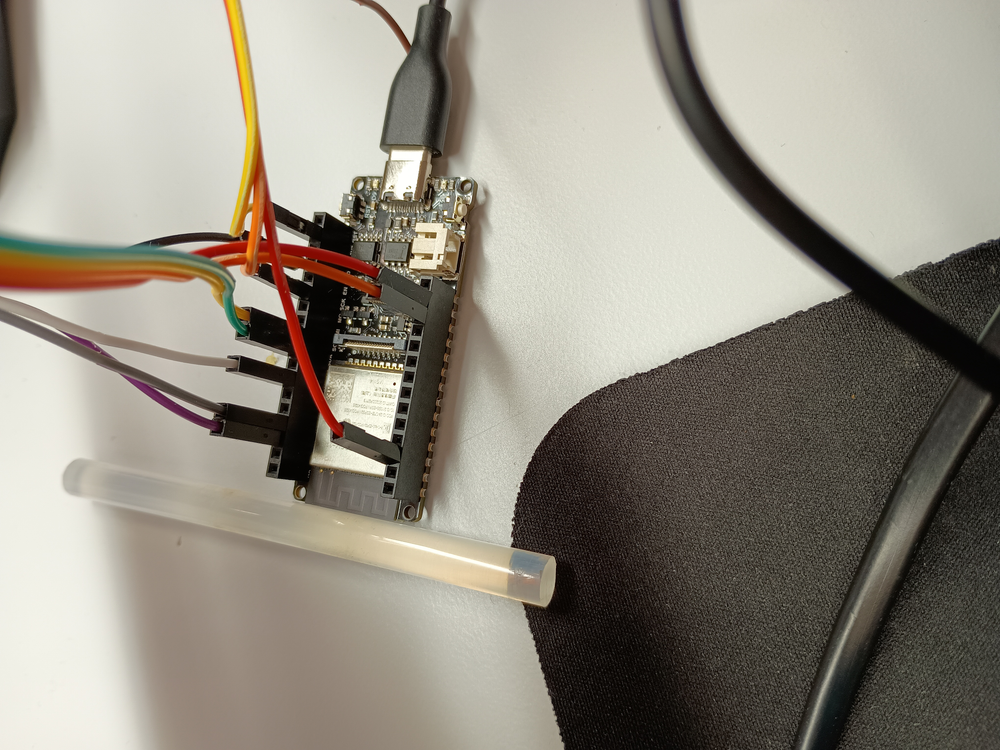

# Smart Cup for Healthcare Hackathon 2026

## Contributors

- [@phil](https://github.com/githp806) — Hardware Architecture, CAD design and 3D printing
- [@alex](https://github.com/alexgloetzl) — Embedded Software & Web Interface

## Motivation

Around 5 million people in Germany suffer from swallowing disorders. Therefore, there is a strong need for a smart drinking cup that supports patients during hydration.

Our system provides several features:

* Visual feedback to encourage a healthier head posture while drinking
* Fill level monitoring to assist caregivers
* Water intake tracking and daily hydration goals for patients

We implemented these features in a modular and low-cost design based primarily on two sensors. The system measures both the cup’s fill level and its tilt angle in real time.

---


## Final Prototype

<div style="display:flex; justify-content:center; align-items:center; gap:14px; flex-wrap:nowrap;">

  <a href="https://youtube.com/shorts/64QTJWFIxZ4?feature=share">
    
  </a>
  
  
  

</div>

---

## Real-Time Metrics

Displays:

* Current weight
* Current tilt angle
* Highest streak

---

## Hardware Components

| Component        | Purpose              |
| ---------------- | -------------------- |
| ESP32-E v1.0     | Main microcontroller |
| HX711            | Load cell amplifier  |
| Load Cell        | Weight measurement   |
| GY271 / QMC5883L | Tilt sensing         |
| RGB LED          | Visual feedback      |

---

## Pin Configuration

### HX711

| HX711 Pin | ESP32 Pin |
| --------- | --------- |
| DT        | GPIO4     |
| SCK       | GPIO18    |

---

### GY271 / QMC5883L

| Sensor Pin | ESP32 Pin |
| ---------- | --------- |
| SDA        | GPIO21    |
| SCL        | GPIO22    |

---

### RGB LED

| LED Color | ESP32 Pin |
| --------- | --------- |
| Red       | GPIO25    |
| Green     | GPIO26    |
| Blue      | GPIO13    |

---

## Installation & Flashing Process

### 1. Erase Existing ESP32 Firmware & Flash MicroPython Firmware

```bash
pip install esptool
python -m esptool --chip esp32 --port COM3 erase_flash
python -m esptool --chip esp32 --port COM3 --baud 460800 write_flash -z 0x1000 ESP32_GENERIC-20260406-v1.28.0.bin
```

---

### 2. Upload Files to ESP32

Upload `main.py` and `index.html`. Here the micro controller was connected to the port COM3:

```bash
pip install mpremote
python -m mpremote connect COM3 fs cp main.py :
python -m mpremote connect COM3 fs cp index.html :
```

---


## How to access Dashboard

Flash both the main.py and index.html. Connect to micro controller with the vscode extension "PyMakr". Reset the micro controller manually with the "Reset" button.<br>
The ESP32 now acts as a WiFi access point. Connect to the WiFi in your browser http://192.162.4.1 (not https://)

WLAN-SSID:
```text
ESP32-DASHBOARD
```

WLAN-Password:
```text
12345678
```

---


## Software Stack

* MicroPython
* HTML

---

## Project Structure

```text
smarter_trinkbecher/
│
├── main.py
├── index.html
└── README.md
```
